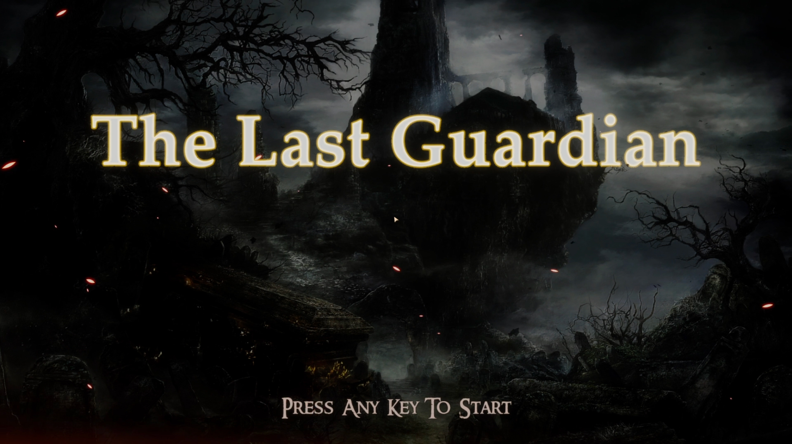
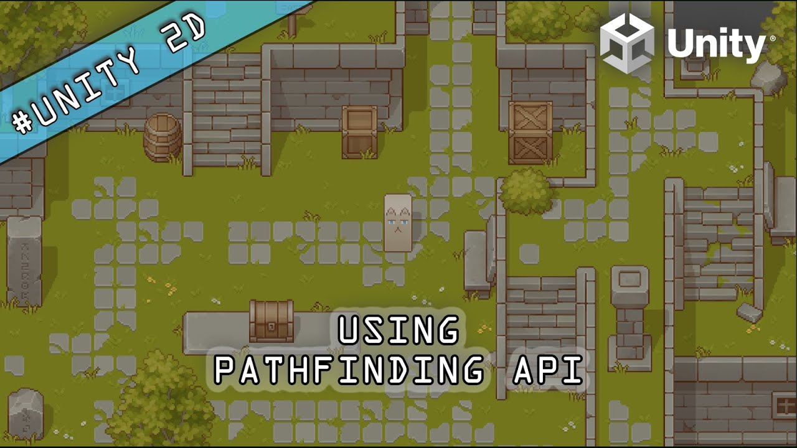

<h2 align="center">
👋 Hi there, Welcome to my GitHub profile!
</h2>

My name is Wong Yan Zhi, a final-year student taking <a href="https://www.tarc.edu.my/focs/programmes/bachelor-degree/bachelor-of-computer-science-honours-in-interactive-software-technology/" alt="Link towards YanZhi's Programme of Study">Bachelor of Computer Science (Honours) in Interactive Software Technology at Tunku Abdul Rahman University of Management and Technology (TAR UMT)</a>. My major of interest was in game design and game development!

<h2 align="center">
My ITCH.IO Profile
</h2>
<h2 align="center">

</h2>

<h2 align="center">
🎮🎮&nbsp;&nbsp;Game Engine&nbsp;&nbsp;🎮🎮
</h2>

I mainly use Unity Game Engine to develop games. However, I am interested in Unreal Game Engine as well! Most probably will spend my free time to explore it in the future.

<h2 align="center">

</h2>

<h2 align="center">🎓🎓&nbsp;&nbsp;Personal / Academic Projects&nbsp;&nbsp;🎓🎓</h2>

<h3 align="center">
🕹&nbsp;[Final Year Project] 3D Game - The Last Guardian&nbsp;🕹
   

</h3>

🔗 Demo Video: <a href="https://youtu.be/iXqZzVhZakc" target="_blank" alt="Link towards YT Demo - The Last Guardian">Click Me!</a>
<h4>📫 Short Intro - The Last Guardian:</h4>

The Last Guardian is a 3D single-player souls-like game. The Chosen One, the protagonist of the game, woke up in the tomb and remembered she had one task - to find and eliminate The Skeleton Lord. There are several levels in the game, and The Chosen One has to face every single one of them in order to reach The Skeleton Lord. The player will be playing as the main character - The Chosen One, and overcome any obstacles during the exploration towards the end.

====================================================================================

<h3 align="center">
🕹&nbsp;3D Game - Akumu&nbsp;🕹
   

</h3>
<!-- 
🔗 Repository: <a href="" target="_blank" alt="Link towards Repository - Kerjasama">Click Me!</a>
 -->

🔗 ITCH.IO Link: <a href="https://spoiler02.itch.io/akumu" target="_blank" alt="Link towards ITCH.IO - Akumu">Click Me!</a>

🔗 Demo Video: <a href="https://youtu.be/ZwfVXeaVWEs" target="_blank" alt="Link towards YT Demo - Akumu">Click Me!</a>
<h4>📫 Short Intro - Akumu:</h4>

Akumu is a 3D single-player story-driven horror game. Ayaka, the protagonist of the game, fell asleep in the classroom and could not leave the school through the main entrance as it was locked. Meanwhile, there were footsteps nearby echoed in the corridor... The player will be playing as the main character - Ayaka, and try to find her way out.

====================================================================================

<h3 align="center">
🕹&nbsp;Game Technology API - AStar & JPS Pathfinding&nbsp;🕹
   

</h3>
<!-- 
🔗 Repository: <a href="" target="_blank" alt="Link towards Repository - Kerjasama">Click Me!</a>
 -->

🔗 Demo Video: <a href="https://youtu.be/wmFuExwGLU8" target="_blank" alt="Link towards YT Demo - AStar JPS Pathfinding API">Click Me!</a>
<h4>📫 Short Intro - AStar & JPS Pathfinding API:</h4>

AStar & Jump Point Search Pathfinding API allows game developers to utilize it in their 2D games. This API uses grid map to mark down walkable and unwalkable areas of the game. Then, the developers may apply the algorithm to search for the nearest path of the in-game character towards the desired destination. The developers may choose to use either JPS or AStar algorithm for their game, as both of the algorithms were included in this API.

====================================================================================

<h3 align="center">
📱&nbsp;Mobile Application Development - Kerjasama&nbsp;📱
   

</h3>

🔗 Repository: <a href="https://github.com/SpoILeR02/Kerjasama" target="_blank" alt="Link towards Repository - Kerjasama">Click Me!</a>

🔗 Demo Video: <a href="https://youtu.be/IeD_slQyLDg" target="_blank" alt="Link towards YT Demo - Kerjasama">Click Me!</a>
<h4>📫 Short Intro - Kerjasama:</h4>

Kerjasama is a groundbreaking mobile application that provides job opportunities and is specifically crafted to empower job seekers and facilitate seamless collaboration with industries seeking skilled and talented individuals. Our mission is simple yet profound: to bridge the gap between job seekers and potential employers, creating a thriving ecosystem where opportunities abound for all.

====================================================================================

<h3 align="center">
📝&nbsp;ReactJS - CREL Generator&nbsp;📝
   

</h3>

🔗 Repository: <a href="https://github.com/SpoILeR02/CREL-Generator" target="_blank" alt="Link towards Repository - CREL Generator">Click Me!</a>

🔗 Website URL: <a href="https://spoiler02.github.io/CREL-Generator/" target="_blank" alt="Link towards Website - CREL Generator">Click Me!</a>

<h4>📫 Short Intro - CREL Generator:</h4>

CREL Generator allows the user to enter the required information for an Email, typically Recipient, Subject, Carbon Copy (CC), Blind Carbon Copy (BCC), and Body. There will be two options for the user to choose from, either generate short URLs for mobile phones or tablets or for desktop PCs. The generated URL will auto-compose an Email content (Gmail) with all necessary information filled in automatically, and the person who opened the URL using browser just have to click Send to send the Email. The shortened URL uses the default Email signed in (for Desktop PCs) and default mailing application (for tablets or mobile phones).

